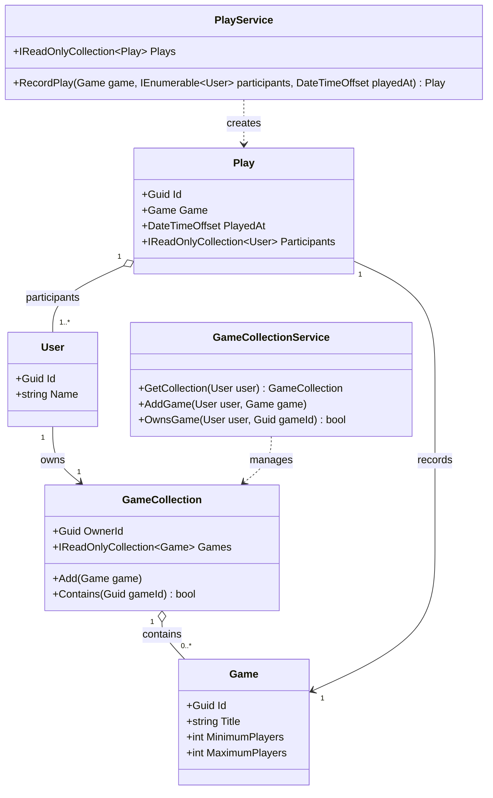

# Board-game domain

This project is a small, persistence-free domain used to demonstrate unit and integration tests. It does not access a database, filesystem, network, or other external system.

## Entities

- `User` represents a player with a stable identifier and display name.
- `Game` represents a board game and its supported player-count range.
- `GameCollection` represents the games owned by one user and prevents duplicate games.
- `Play` records a game, its participants, and when it was played.

## Services

- `GameCollectionService` manages in-memory collections and answers ownership queries.
- `PlayService` validates player counts, rejects duplicate participants, and keeps an in-memory play history.

The services intentionally keep their state in memory so tests can exercise the domain without provisioning external infrastructure.

## Class diagram

